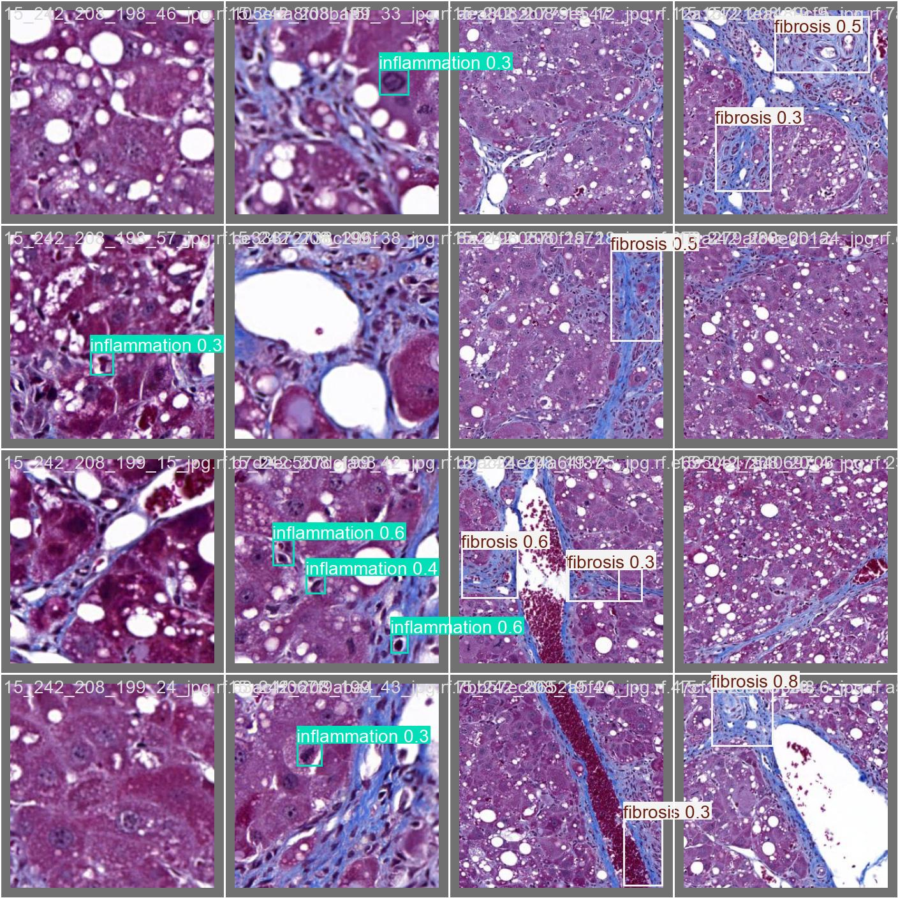
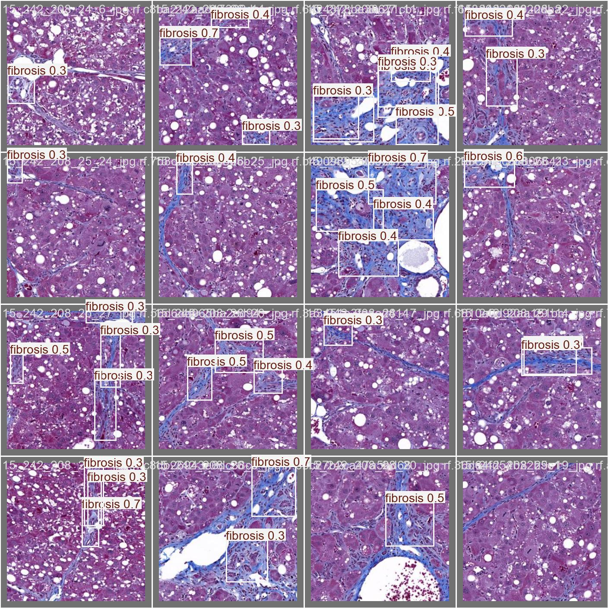

# 🧠 HepatoAI – Scalable Microbatched Liver Histopathology Detection System

> Real-time & batch object detection for liver biopsy histopathology images using DETR & YOLOv8, built with a production-grade FastAPI backend and microbatched GPU inference.

---

## 🚀 Overview

HepatoAI is an end-to-end AI-powered detection system designed to identify key histopathological features in liver biopsy images:

* **Fibrosis**
* **Inflammation**
* **Steatosis**
* **Ballooning**

The system supports:

* ⚡ Real-time single-image detection
* 📦 High-throughput batch processing
* 🔄 Microbatched GPU inference
* 📊 Latency benchmarking & metrics tracking
* 🧩 Modular model backend (DETR / YOLOv8 / ONNX / Torch)

This project focuses not just on model accuracy, but also on **scalable inference architecture, latency optimization, and production-readiness**.

---

## 🎬 Demo Video

▶️ [Watch the 30-Second Demo](./assets/demo_hepato.mp4)

---

## 🖼 Sample Predictions

### Example 1


### Example 2


### Example 3


---

# 🏗 System Architecture

```text
Client
   ↓
FastAPI Server
   ↓
MicroBatcher
   ↓
InferenceEngine (DETR / YOLOv8)
   ↓
ONNX Runtime / Torch
   ↓
SQLite (metadata + detections)
```

### Key Design Decisions

* Modular inference engine abstraction
* Microbatching to improve GPU utilization
* Asynchronous background processing for batch uploads
* Latency percentile tracking (p50, p95)
* Model-agnostic backend switching

---

# ⚙️ Tech Stack

### Backend

* FastAPI
* Asyncio
* SQLite (WAL mode)
* Pydantic

### ML / Inference

* DETR (Transformer-based detection)
* YOLOv8 (Anchor-free CNN detection)
* ONNX Runtime
* PyTorch

### Performance Optimization

* Microbatching
* GPU concurrency tuning
* Latency percentile monitoring

---

# 📊 Performance Benchmarks

### Single Detection API (1200 Requests)

| Concurrency | p50 Latency | p95 Latency | Throughput |
| ----------- | ----------- | ----------- | ---------- |
| 1           | 17 ms       | 19 ms       | 57 RPS     |
| 4           | 78 ms       | 85 ms       | 180 RPS    |

### Multi-Detection API

| Metric | Value   |
| ------ | ------- |
| p50    | ~597 ms |
| p95    | ~656 ms |

> Insight: End-to-end latency is dominated by queueing + I/O under high concurrency, not just GPU compute.

---

# 🧠 Model Performance (mAP@0.5)

| Model  | Validation mAP | Test mAP |
| ------ | -------------- | -------- |
| DETR   | 0.56           | 0.57     |
| YOLOv8 | 0.50           | 0.52     |

DETR provides stronger global reasoning, while YOLOv8 offers faster inference under certain configurations.

---

# 🔁 Microbatching Explained

Instead of running inference per request:

```text
Request 1 → GPU
Request 2 → GPU
Request 3 → GPU
```

HepatoAI batches requests:

```text
[Req1, Req2, Req3, Req4] → Single GPU Call
```

Benefits:

* Better GPU utilization
* Higher throughput
* Reduced per-request overhead

Tradeoff:

* Slight batching delay

---

# 📦 Batch Processing Pipeline

1. Upload multiple images (`/v1/assets`)
2. Persist images to storage
3. Submit images to microbatcher
4. Run inference
5. Store detections + latency
6. Track progress & asset state

Status transitions:

```
pending → processing → done / done_with_failures
```

---

# 🛠 Installation

```bash
git clone https://github.com/your-username/hepatoai.git
cd hepatoai
python -m venv .venv
source .venv/bin/activate
pip install -r requirements.txt
```

---

# ▶️ Running the Service

```bash
uvicorn app.main:app --reload
```

Open:

```
http://localhost:8000/docs
```

---

# 🧪 Example API Usage

### Single Detection

```bash
curl -X POST "http://localhost:8000/v1/detect" \
  -F "file=@sample.jpg"
```

### Batch Upload

```bash
curl -X POST "http://localhost:8000/v1/assets" \
  -F "files=@img1.jpg" \
  -F "files=@img2.jpg"
```

---

# 🔮 Future Improvements

* TensorRT optimization
* INT8 quantization
* Object storage integration (S3)
* Redis-based distributed microbatching
* Kubernetes autoscaling
* Postgres for higher concurrency

---

# 🎯 Why This Project Matters

Manual histopathology review:

* 5–30 minutes per case
* 1–7 day turnaround
* Inter-observer variability

HepatoAI demonstrates how AI + scalable backend systems can:

* Reduce detection latency to milliseconds
* Support high-throughput labs
* Provide structured, reproducible outputs
* Integrate into modern ML-driven workflows

---

# 📌 Key Engineering Learnings

* GPU throughput ≠ API latency
* Tail latency (p95) dominated by queueing under load
* Microbatching improves utilization but must be tuned
* Inference optimization requires both model + systems thinking

---

# 📜 License

MIT License

---

# 👤 Author

Manisimha Varma
---


